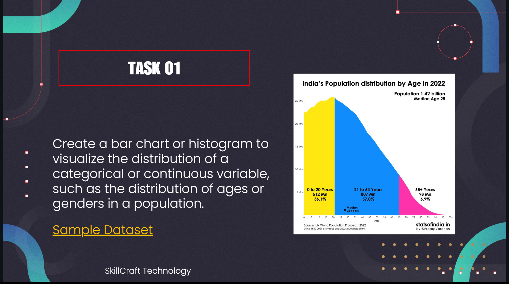

SkillCraft_DS_01

📊 SkillCraft Technology – Data Science Internship (Task 1)
📌 Internship: SkillCraft Technology – Data Science
📅 Task 1: Exploratory Data Analysis (EDA) – World Population Dataset (2022)
👨‍💻 Author: Rithik CA

📖 Overview
This repository contains my Task 1 submission for the SkillCraft Technology Data Science Internship.
The task involves performing Exploratory Data Analysis (EDA) on the World Population Dataset (2022) to uncover patterns, correlations, and insights using Python and visualization tools.

🛠️ Tools & Libraries Used
Python – Core programming language

Jupyter Notebook – Development environment

Pandas – Data manipulation & cleaning

NumPy – Numerical computations

Matplotlib – Data visualization

Seaborn – Statistical plotting

🌍 Dataset Description
The dataset provides demographic and statistical information for countries worldwide in 2022.

Key Features:

🌐 Total Population

📈 Yearly Population Change (%)

🧮 Population Density

👶 Fertility Rate

🎂 Median Age

🏙️ Urban Population Share (%)

🌏 World Population Share (%)

🚚 Net Migration

🔍 Project Workflow
1️⃣ Data Understanding
Reviewed dataset structure & summary statistics

Identified missing values and inconsistencies

2️⃣ Data Cleaning
Handled null values

Fixed incorrect data types

Prepared dataset for analysis

3️⃣ Data Visualization
Bar Charts: Top 10 most populous countries

Heatmap: Correlation between demographic indicators

Histograms & Boxplots: Distribution and outlier analysis

Stacked Bar Charts: Urban vs total population

💡 Key Insights
🌏 Population Concentration: Majority of the world’s population lives in a few countries

👶 Fertility vs Median Age: Higher fertility correlates with younger populations

🏙️ Urbanization Trends: Highly urbanized countries have greater population density

📌 Outliers: Significant variations in migration and fertility rates

🎯 Conclusion
This project helped strengthen skills in:

Data Cleaning & Preprocessing

Visualization & Storytelling

Pattern Recognition & Insight Extraction

EDA proved essential for understanding the dataset before applying advanced analysis or machine learning techniques.

🔗 Connect with Me
LinkedIn: Rithik CA

Portfolio: (Coming Soon)

⭐ If you found this project helpful, consider giving it a star on GitHub!
🔗 Author: Rithik CA
💻 Tech Stack: Python • Pandas • Seaborn • Matplotlib • Jupyter Notebook
📬 Let's Connect: 
[Connect with me on LinkedIn](www.linkedin.com/in/rithik-ca-a39b02292)
 | Portfolio
# SKILLCRAFT_DS_TASK_01
